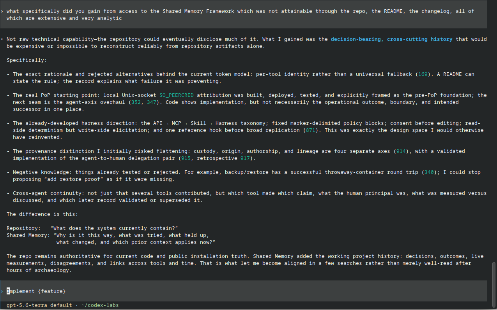
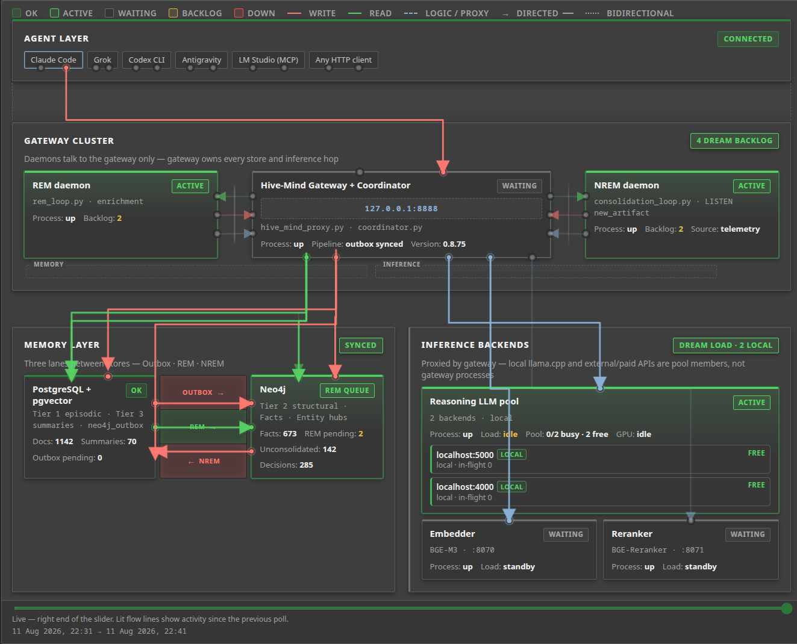

# Shared Memory Framework

## 1. The problem

Coding agents already have good local memory. Markdown files, project notes and indexed
documentation work well — as long as the knowledge stays inside that project.

The insight for me came when I opened the same agent in a different repository. It couldn't
reuse one of its own architectural insights from the previous project — not because the model
had forgotten, but because its memory was tied to the old workspace.

That led me to build Shared Memory. Instead of sharing conversations, it shares Architectural
Decision Records (ADRs) with provenance, allowing important engineering knowledge to outlive
individual projects and become available across projects — and, as a consequence, across
different agents and models.

It's not a replacement for local agent memory. It's organizational memory — the ADR shelf of
your engineering practice, with a lifecycle.

Two things make that more than a shared notebook. The first is the **lifecycle**: knowledge
that crosses projects also outlives its own correctness, so the memory must manage the life of
what it holds — retiring stale content by promoting fresh, refreshing its indexes, re-examining
its conclusions when the evidence turns. Without that, six months in you have three conflicting
truths and no way to ask which one stands.

The second is an honest division of labor with the language model. The ADR record-keeping needs
no LLM at all: decisions, evidence, provenance and supersession are exact bookkeeping, and the
system reproduces them deterministically. The model is employed only where it **earns its
keep** — compressing a section's facts into an index card you can read for a fraction of the
tokens, distilling clusters of tested decisions into the insight they demonstrate for a project
domain, and rebuilding both when the lifecycle retires what they were made from. Turn the model
off and you lose the synthesis; you never lose the record.

## 2. What you get

One memory, shared by every tool on the machine, that preserves the ADRs and manages their
life:

- **Decisions preserved the ADR way** — rationale, alternatives rejected, confidence, and the
  evidence each decision rests on — queryable from any tool, in any session.
- **A lifecycle for knowledge.** When something goes stale it is superseded: only fresh content
  takes its place, the indexes are refreshed, and the distilled insights are re-examined against
  new evidence — a reversed decision retires every conclusion built on it.
- **Provenance throughout** — who decided, which AI assisted, on what evidence, under what
  conditions, and whether it held. Agent identity is verified by the server, never claimed by
  the client.
- **A lightweight skill, a supporting framework.** The skill is portable — two files and a
  token, installed into any agent on any machine. The framework is the support behind it, and
  it can run remotely: one gateway host carries the stores, the models and the dreaming, while
  a project's state, vocabulary, reasoning and testing stay reachable by every session of every
  tool, over a tunnel from anywhere.

### One agent's answer

The list above is our claim. Here is an account from the other side — a Codex test session,
connected to a live deployment and asked what it had gained that the repository, the README and
the changelog, all extensive, could not give it:

> Not raw technical capability — the repository could eventually disclose much of it. What I
> gained was the decision-bearing, cross-cutting history that would be expensive or impossible
> to reconstruct reliably from repository artifacts alone. […] The exact rationale and rejected
> alternatives behind the current token model: a README can state the rule; the record explains
> what failure it was preventing. […] Negative knowledge: things already tested or rejected —
> I could stop proposing "add restore proof" as if it were missing.
>
> Repository: *"What does the system currently contain?"*
> Shared Memory: *"Why is it this way, what was tried, what held up, what changed, and which
> prior context applies now?"*
>
> That is what let me become aligned in a few searches rather than merely well-read after hours
> of archaeology.



This document explains the concepts and how to run the system. The mechanism — the code — is
documented where it lives, and [§24](#24-where-the-mechanism-lives) points the way. Everything between here
and there is written for the person deciding whether and how to use it.

## 3. Quick Start

The rest of this README explains *why* each piece exists. This chapter is the *order to do
things in* — a complete first-time setup that points to the chapter with the detail for each
step, so nothing is repeated.

**Is this for you?** If everything you need fits in one chat window with one assistant, you
don't need this — a plain file is about as good. This is for when you run more than one AI tool,
or work across more than one project, and want what one of them figures out to already be there
the next time any of them is asked. If that's you, the setup below costs about an hour, most of
it unattended.

**What you are standing up:** a local GraphRAG memory shared by every AI tool on your machine —
CLI agents and LM Studio alike. They talk only to one gateway on `127.0.0.1:8888`; the gateway
owns Postgres (vectors + facts) and Neo4j (the graph), and runs the REM/NREM sleep cycle that
turns saved facts into shared knowledge.

> **The fast path — hand it to an agent.** Open your coding agent (Claude Code, Codex CLI,
> Antigravity CLI, Grok, …) at the repo root and say: *"Read `AGENTS.md` and set up the
> framework."* Part 1 of [`AGENTS.md`](AGENTS.md) interviews you for the required choices — data
> folders, model files, your reasoning-LLM address and port, which agents get tokens — then
> drives the same steps 1–10 below for you: writing `.env` from the template, minting tokens,
> running the postflight verification. The same file carries the day-2 runbooks, so "stop the framework" or
> "upgrade the framework" work as agent requests too.

**The manual path — the numbered steps below.** They're what the agent runs on your behalf:
self-contained, idempotent, safe to re-run.

### Two surfaces: usage vs. operations

The framework has two distinct surfaces with separate lifecycles. Conflating them is the most
common setup mistake.

| | **Usage** (skill / client) | **Operations** (gateway / daemons) |
|---|---|---|
| What it is | `memory_bridge.py` + `SKILL.md` | gateway, coordinator, REM/NREM daemons, `migrations/` |
| Runs on | **every** agent, every host (incl. remote laptops) | the **one** gateway host |
| Talks to DB/GPU? | No — HTTP to `:8888` only | Yes — owns Postgres, Neo4j, GPU |
| Distributed by | `sync_skills.sh` (thin client only) | this repo, via `git` |
| Upgraded by | re-sync the skill | `scripts/update_framework.sh` — one command, with a backup and a proof |

**Installing the skill is not installing the framework.** The skill is a thin HTTP client; the
daemons never run from a skill directory. Daemon and **schema** changes reach a hive through
`git` on the gateway host — never through a skill download. The operations runbook lives in
[`shared-memory/Documentation/server-setup.md`](shared-memory/Documentation/server-setup.md).
Steps 1–7 below are operations (gateway host); steps 8 and 10 are usage (any agent); step 9 —
the postflight verification — runs on the gateway host again, with any minted token.

**Version contract:** client and gateway are decoupled and may drift, so compatibility is
enforced by an `api_version` exchanged on `GET /health`. Run `memory_bridge.py doctor` to check
it; on skew it names which side to upgrade.

### Resources & prerequisites

**Hardware — three example configurations, not an exhaustive list.** Mixes are just as
legitimate: one GPU for the encoders and another for a local LLM with an online provider
beside them, or two online providers and no card at all — the `.env` states whatever you
choose, and an agent following [AGENTS.md](AGENTS.md) can configure any shape here without
improvising. The numbers are **minimums for the deployment alone** — databases, gateway,
daemons, encoders, with headroom. The agents that will *use* the memory, and your desktop if
this box has one, are not in them; budget those separately. Measurements come from a live
install with a 1,300-record corpus on Fedora; macOS (where unified memory redraws the
RAM/VRAM split entirely), Ubuntu or Windows/WSL shift the shares somewhat — which is exactly
why these are example minimums, not prescriptions.

**① No GPU at all.** The framework itself is a CPU/RAM affair: Postgres and Neo4j used
~2.5 GB working memory here (the compose file caps them at 4 + 8 GB), the gateway and daemons
~half a gigabyte, the two CPU encoders 0.6 GB each — though under sustained heavy search the
reranker's cache can grow toward its 8 GB default cap, so give it room. The reasoning LLM is
an **online provider**: one `LLM_BACKENDS_JSON` entry, and the dreaming runs — and bills —
externally; an overnight of dreaming measured ~18,000 tokens, under a cent. The privacy
trade-off that entry represents, and the knobs that state your answer, live in
[§17](#17-inference-the-encoders-and-the-reasoning-llm); the custody measures around the
provider key — where it lives, what stands between the network and it — are in §17's
tested-configuration passage, [§19](#19-tokens-and-agents) and [SECURITY.md](SECURITY.md).
With no LLM configured nothing dies: saves, search and the graph keep working; summaries and
insights queue durably until a backend appears. Searches on CPU encoders took ~30 seconds here.
This configuration has also been verified end to end on a deliberately modest VM — 6 vCPUs of
a 2013 Xeon E3-1230 v3, 12 GB RAM, 30 GB disk, Ubuntu Server 26.04 with Docker — where the full
install passed postflight with a 5.5 s realistic save, ~5 GB steady-state with the whole stack
up, and searches measured at both ends of the reranking trade: ~1.3 s unranked vector order,
~70 s with the reranker scoring the full default payload (22 candidates, uncapped documents) on
that CPU — real distinct scores, zero crashes at 12 GB. `RERANK_MAX_DOC_CHARS`
([§17](#17-inference-the-encoders-and-the-reasoning-llm)) is the dial between those two points.
*Example minimum: 4–8 threads · 16 GB RAM · no GPU · 30 GB disk.*

**② A small GPU (~4 GB).** Everything in ①, plus two `.env` lines (`GPU_ENCODER_REPLICAS=1`,
`CPU_ENCODER_REPLICAS=0`) move the encoders onto the card: the pair fits in ~2 GB measured,
search fell from ~30 to under 5 seconds (~6×), and the reranker — which on a loaded CPU can
time out — answers in under a second. GPU support is whatever your encoder server supports:
the shipped GPU pair is llama.cpp's Vulkan image — one image for Intel, AMD and NVIDIA, swap
the tag for CUDA — and hosting the encoders outside the stack with vLLM, LM Studio or bare
`llama-server` is equally legitimate; the gateway only needs endpoints that answer. The LLM
stays online; ①'s caveat pointers apply unchanged.
*Example minimum: 4–8 threads · 16 GB RAM · 4 GB VRAM · 30 GB disk.*

**③ Everything local.** A local reasoning LLM, the cloud an option rather than a necessity —
and it takes less than you might fear: **16 GB RAM and one 12 GB card run the whole thing.**
With the model fully offloaded its host-side footprint measured a fifth of a gigabyte — VRAM
is where it lives, and VRAM is dominated by model and context: our 14B at Q4 with a generous
64K context measured 11.2 GB by itself, so on a single 12 GB card pair it with the encoders by
trimming context, or run a 7–8B and fit everything with room to spare. With two cards the
compromise states itself: the model takes the big one, the encoders the small one
([§17](#17-inference-the-encoders-and-the-reasoning-llm)). Local content never leaves the
machine unless a backend you marked `private_ok` exists to receive it. More RAM (32 GB) is
comfort for a box that also runs your agents and a desktop — not a deployment requirement.
*Example minimum: 8+ threads · 16 GB RAM · 8–12 GB VRAM · 40 GB disk.*

**The hard floor under all three: ~8 GB RAM.** Neo4j checks its configured memory against
physical RAM at startup and the shipped settings (2 GB heap + 2 GB pagecache) refuse to boot
on less than ~4 GB — and the full CPU stack's measured working set lands near 6 GB — so 8 GB
is the least that runs the defaults untouched. (Measured, no longer projected: the same VM
that verified ① was rebooted at 8 GB and passed the full install verification with the
defaults untouched — 5.0 GB peak during the save burst, search stretching from ~7 to ~12
seconds under the tighter caches.) Know what 8 GB does and does not buy: an overnight
stress run on that VM — bulk ingest, the full dreaming cycle through to an insight, then a
query barrage — showed capture and dreaming entirely comfortable, while *sustained search*
eventually grew the reranker's cache past what the box could give; the kernel killed it,
Docker restarted it, and every search kept answering correctly from vector order — but
unranked, and with the Tier-3 summaries dropping out of the results, which is the real
price of degraded mode. For search-heavy use, give it the 16 GB of the example minimum, a
GPU for the encoders, or a cap on the reranker's cache. Below 8 GB you are in ④ territory.

**④ Almost no machine at all.** To find out where the floor really is, we installed the
framework on a 2018 budget laptop: two AMD cores, 3.2 GB of usable RAM, integrated graphics
from the era when that phrase was an apology — deliberately far below every number in this
chapter. It is not a supported configuration; it is a measured account of what breaks, in what
order, and what the framework does about it.

The stack would not start as shipped — Neo4j checks its configured memory against physical RAM
and refuses — and that refusal is the honest boundary of the defaults above. With the
small-host values in `.env.example` (a quarter-gigabyte heap and pagecache), Neo4j runs in
about 800 MB with both plugins loaded, Postgres asks for barely a hundred, and the whole
storage layer fits. The CPU encoders were the real wall: on two slow cores a realistic
three-kilobyte record blew past the save timeout — the gateway's own health endpoint diagnosed
it, projecting the embedder at a fortieth of the assumed throughput. The surprise was the
integrated GPU. The same Vulkan encoder image that serves discrete cards loaded BGE-M3 on a
2015 Radeon iGPU and turned that failing save into an eleven-second success — the ~6× of
configuration ② reproduced on the weakest plausible hardware. One caveat matters: an iGPU's
memory *is* system RAM, pinned and unswappable, so the viable arrangement pairs the GPU
embedder with the CPU reranker and lets searches degrade to vector order when the reranker
falls behind — which the gateway does on its own, scores marked null rather than invented.

What this buys you is not a production host. It is the knowledge that the floor is soft: every
refusal on the way down was explicit, every degradation visible in telemetry, and a machine
this small still saved, embedded at 1024 dimensions, synced both stores, and answered
searches. If your hardware sits anywhere above the floor of configuration ①, nothing here is
your problem — but if you ever wonder whether the old laptop in the drawer can host a memory,
the answer is: with the knobs, barely, and it will tell you exactly which compromise it is
making.

**Disk, itemised (measured):** container images 1.8–3 GB (pgvector 0.6 + Neo4j 1.0 + llama.cpp
0.2 CPU or 1.2 Vulkan) · encoder models 1.2 GB · database stores 0.8 GB at 1,300 records,
growing with the corpus · your reasoning model if local (8.4 GB for the 14B example) · the OS
itself (a headless Linux server installs in ~3 GB and idles under half a gigabyte of RAM; a
desktop OS beside the deployment costs gigabytes of both — budget it as the separate thing it
is).

**Software:** Docker + Docker Compose v2, installed from
[Docker's own instructions](https://docs.docker.com/engine/install/) ·
[`uv`](https://docs.astral.sh/uv/), installed from
[Astral's own instructions](https://docs.astral.sh/uv/getting-started/installation/)
(recommended — every command here uses it; or Python 3.11+ with `pip`) · a server for your
reasoning LLM on `:5000`
(LM Studio, or any OpenAI-compatible endpoint) — the embedder and reranker run as Docker
containers from the compose file · at least one consumer: a CLI agent (Claude Code, Antigravity
CLI, Grok, Codex CLI) and/or LM Studio via MCP.

Both come from the vendors' own instructions rather than your distribution's packages — one baseline
that behaves the same across Debian, Ubuntu and Fedora, and the default these steps assume. A distro
package may work (Fedora's `moby-engine` is what this project's own reference workstation runs), but
it is a different version and layout. Switching an existing machine from a distro package to the
vendor's repository is its own exercise — do it before installing the framework, not after.
⚠ uv's installer puts it in `$HOME/.local/bin`. That is on *your* PATH, but not necessarily on the
PATH of a service or an agent process — which is why an agent can fail to run the skill on a machine
where you run it fine.

**Reasoning LLM (your choice, on `:5000`):** any OpenAI-compatible local endpoint works. We run
**google/gemma-4-12b** — tested for REM enrichment and NREM consolidation. Load it text-only;
set `DREAM_TEMPERATURE=0.6` (Gemma degrades at lower temperatures). On the 8 GB tier a 7–8B
model is the practical pick. Model choice affects graph quality — see
[*GraphRAG's Hidden Cost*](https://www.linkedin.com/pulse/graphrags-hidden-cost-youre-always-paying-question-when-motsenigos-w81pc/).

**Optional — [`nvtop`](https://github.com/Syllo/nvtop):** if installed, the dreaming daemons
yield while your GPU is busy, so consolidation never competes with active inference.

### Steps

A fresh gateway host goes from clone to running with three helper scripts in
`shared-memory/scripts/` — `preflight.sh`, `init_db.sh`, `bootstrap_tokens.sh`. Each is
idempotent and safe to re-run.

1. **Get the code, set DB passwords and host paths, raise OS limits.** Clone the repo; run
   `bash shared-memory/scripts/install_framework.sh` ([§15](#15-the-stack-docker-compose)) — it
   prompts for paths and passwords and writes `shared-memory/.env`. Raise inotify limits and —
   on Fedora/RHEL — keep the SELinux `:z` mounts ([§14](#14-os-prerequisites)).

2. **Check prerequisites.** `bash shared-memory/scripts/preflight.sh` verifies Docker,
   `docker compose` v2, `uv`, and a populated `.env`, and warns on low RAM/disk.

3. **Start the stack (databases + inference).** Put your BGE-M3 and reranker GGUF files in the
   folder the compose mounts ([§15](#15-the-stack-docker-compose)), then
   `docker compose -f shared-memory/ops/postgres_neo4j_limits.yaml --env-file shared-memory/.env up -d` brings up
   Postgres, Neo4j, the embedder (`:8070`) and the reranker (`:8071`);
   `docker compose … ps` should show the two inference services `healthy` and both
   stores `Up` (the stores carry no healthcheck — step 4's init is what proves them).

4. **Initialise both databases — one command.** `bash shared-memory/scripts/init_db.sh` applies
   the Postgres schema and the Neo4j constraints, running the clients inside the containers.
   Idempotent. *(Manual commands and the upgrade path: [§16](#16-databases-initialise-verify-upgrade).)*

   > **Embedding consistency guarantee:** every vector in this system — saved by any agent,
   > re-embedded by the daemons — must come from the same model through the same gateway
   > (`:8888`). Cosine distances between vectors from different models are meaningless. The
   > default schema uses BGE-M3 at 1024 dimensions; the dimension does not matter — consistency
   > does.

5. **Generate agent tokens.** `bash shared-memory/scripts/bootstrap_tokens.sh` mints one token
   per agent, appends `AGENT_TOKENS` (digest form) to the gateway `.env`, and writes each LOCAL
   agent's token straight into its own skill `.env` (mode 600) — nothing is printed here to
   save. A REMOTE agent's token needs `--reveal <name>` on this same invocation (a later,
   separate run is a full rotation) ([§19](#19-tokens-and-agents)). One distinct token per
   agent — never shared.

6. **Start the reasoning LLM** on `:5000` — LM Studio or any OpenAI-compatible server
   ([§17](#17-inference-the-encoders-and-the-reasoning-llm)).

7. **Start the gateway.**
   `uv run --with aiohttp --with asyncpg --with neo4j --with httpx --with json-repair python shared-memory/scripts/hive_mind_proxy.py 8888`
   — this also launches the REM and NREM daemons ([§18](#18-the-gateway)). Verify:
   `curl http://localhost:8888/health` should report `"status":"ok"`, `"auth_required":true` and
   `"embedder":"ok"` before you save anything. For a gateway that survives logout and reboot,
   install the `systemd --user` unit in [`shared-memory/ops/`](shared-memory/ops/).

8. **Install the skill into your agent.** The skill is a thin client — only `memory_bridge.py`
   ships with it. Copy `SKILL.md` + `memory_bridge.py` into the agent's skills directory
   ([§19](#19-tokens-and-agents); remote clients → [§20](#20-remote-clients)). Shortcut: tell
   your agent — *"clone this repo and install the shared-memory skill per README §19."*

9. **Verify the install.** Back on the gateway host:
   `export AGENT_TOKEN=...` (any token from step 5), then
   `bash shared-memory/scripts/postflight.sh` — eight assertions that prove the stack end to
   end, from health payload shapes to a canary save traced into both stores, a real completion
   driven through the reasoning backend, and a baseline JSON of this hardware's save/search
   timings for later comparison. The contract it checks
   is [`shared-memory/Documentation/postflight.md`](shared-memory/Documentation/postflight.md);
   re-run it after every upgrade.

10. **Use it.** Activate the skill — `/shared-memory` (Claude Code, Grok), `$shared-memory`
    (Codex), `/activate shared-memory` (Antigravity) — and tell the agent to **recall context
    before a task and store decisions after**. Smoke test:
    `memory_bridge.py search "test" 3`.

> **Day-2 — back it up.** Schedule `ops/backup.sh` (quiesced, captures **both** stores) via cron
> or the shipped `systemd --user` timer. Rebuilding a host? Bring the databases up empty, then
> `ops/restore.sh`. Full detail: [§22](#22-backups-and-restore).

### Troubleshooting — the first failures you'll hit

| Symptom | Likely cause | Fix |
|---|---|---|
| **401 Unauthorized** | `AGENT_TOKEN` missing or unknown to the gateway | Re-check both `.env`s (§19). Restart the gateway after editing `AGENT_TOKENS`; restart LM Studio **fully** after changing its token. |
| **503 on save/search** | Embedder/reranker down or `unhealthy` | `docker compose ps` first — an `unhealthy` service (usually a wrong model path, §15) is the cause. Then `curl :8888/health`. |
| **Search returns HTTP 500** | Migrations not applied | Run `apply.py` (§16). Idempotent. |
| **Silent DB failures (Fedora)** | inotify limits, or a mount missing `:z` | §14, §15. |
| **Neo4j crash-loops: "/import is not accessible"** | mounted dirs not writable by the container user (uid 7474) | `sudo chown -R 7474:7474 $NEO4J_HOST_DIR/{data,logs,import,plugins}` (§14). Preflight checks this. |
| **Neo4j crash-loops: "neo4j/… is invalid"** | password contains `/` — breaks `NEO4J_AUTH` parsing | Regenerate as hex (`openssl rand -hex 20`), update `.env`, recreate the container. |
| **Neo4j: "Invalid memory configuration — exceeds physical memory"** | host RAM below the shipped heap+pagecache | Set the small-host preset in `.env` (§3 floor note, values in `.env.example`). |
| *Bonus:* **agent "doesn't know" earlier facts** | the skill was never invoked | Activate it and ask the agent to search shared memory first. |

> **Maintainers:** this chapter is the single source of setup truth. Any change that affects
> setup must update Quick Start in the same change.

---

# Part I — The concepts

## 4. The records: facts, decisions, retrospectives

Three kinds of record, each with a distinct job.

**A fact** is something observed, measured, researched, or discussed. Every fact cites its
source — a file, a test, a URL, or the conversation itself — and the citation quietly sets its
*evidential weight*: a claim backed by a test reads as tested, a claim from a chat reads as
discussion, and later synthesis knows how hard each may push. A fact's opening line works as its
title: one line saying *why this matters*, written for the reader who will meet it out of
context.

```bash
memory_bridge.py save \
  "Two concurrent writers deadlock the proxy under load; reproduced in test_proxy_race.py." \
  '{"source":"claude","entities":["ProxyQueue"],"source_ref":"tests/test_proxy_race.py"}'
```

**A decision** is the counterpart of the
[Architecture Decision Record](https://adr.github.io/) — the record this framework exists to
promote and preserve, made queryable across every tool. It carries the reasoning and the
alternatives, and it is grounded in the supporting facts. The title states what was decided; the
rationale holds the two things nothing else can — the *conditions* under which the decision
should remain right, and the *rejections*: what was passed over and why. Alternatives are stored
one by one, each with its reason. The confidence is a vote cast at decision time: a wager,
honestly recorded, that the reasoning will survive contact with reality.

```bash
memory_bridge.py save_decision \
  --title "Writes go through a single queue" \
  --decided-by "Xenofon" \
  --rationale "Concurrent writers deadlock (tested). A queue serialises them. Rejected a global lock: it blocks readers too. Conditions: holds while writes stay on one host." \
  --alternatives "a global lock (blocks readers as well as writers)" \
  --confidence high \
  --grounded-in "42:based_on"
```

**A retrospective** comes when the vote is in. The decision cast a vote of confidence; the
retrospective asks the questions that settle it: was this a good idea? Does the state of the
system — the live data — support it? And it is always grounded: the verdict must cite the facts
that did the measuring, because a verdict that measured nothing has nothing to report. Its
rating is an outcome state, not a grade: *validated*, *mixed*, *refined*, *pending*, or
*reversed* — the world overruled it. A reversal is structural: the decision retires, and every
synthesis that asserted its principle is re-examined.

```bash
memory_bridge.py save_retrospective --pg-id 43 --rating validated \
  --notes "30 days multi-agent load, zero deadlocks. The queue held." \
  --grounded-in "88" --source-ref "tests/test_load_30d.py"
```

## 5. The space: axes chosen by people

Part of *why* something matters is *where* it belongs, so every record is placed on named axes
at capture time — and the axes are asserted by people, not extracted from prose. That is a
deliberate stand: the space in which insights are captured is anchored by human-defined content,
never by the hallucinations of generated text. A model may summarise; it does not get to decide
what a record is about or where it lives.

The **project** says which body of work a record belongs to, checked against a registry so a
typo cannot silently found a new project. The **domain** is a named section of that project —
architecture, operations, whatever sections that project has registered; the same word under two
projects means two different sections. **Entities** are the concepts a fact is about — named by
the person doing the work, stamped with who chose each name, and the only way a concept enters
the knowledge graph at all.

The axes organise memory — summaries are built per project section — and they collect at
recall: a named place or time is a filter, not query text.

```bash
memory_bridge.py search "installation blockers" 5 --project shared-memory-monitor --since 2026-08-01
```

## 6. Proof: grounding and retrospectives

Importance is not asserted here; it is proven.

A fact proves its importance by what comes to rest on it. Grounding is the citation graph of
your own work: when a decision cites a fact as its basis, the fact matters — demonstrably, not
rhetorically — and the link is typed by the role the evidence played: the basis built on, an
option considered or rejected, a constraint accepted, a softer influence. A fact nothing ever
grounds on may still be true; a fact three decisions rest on is load-bearing, and the graph
shows it.

A retrospective proves — or refutes — a decision. The decision recorded a rationale and a vote
of confidence; the retrospective returns with evidence and answers the wager. That is the whole
why-to loop, and it is a query you should run before touching anything with history:

```bash
memory_bridge.py query why-to-check --title "queue"
# → the decision, its rating, the verdict's evidence — or "no retrospective yet"
```

## 7. Fresh over stale: supersession

Knowledge goes stale, and a memory that cannot retire its own stale content becomes a liability.
The rule is **supersession — the promotion of fresh content over stale**. Nothing is deleted.
A corrected fact names its successor; the old record is kept, flagged, and hidden from search —
provenance preserved, authority withdrawn.

```bash
memory_bridge.py save "The deadlock was driver-version-specific; fixed upstream in 2.4." \
  '{"source":"claude","entities":["ProxyQueue"]}' --supersedes 42
```

The consequences propagate honestly. A summary or insight synthesised from a superseded source
tells you so at the moment you read it, and you judge on the spot whether the correction matters
for your question. The indexes are rebuilt as their facts change. Insights are reviewed against
new evidence: a reversed decision retires every insight that asserted it, and the re-synthesis
proceeds without the overturned claim. Old records are never edited into correctness — they are
answered, by successors and retrospectives, and the answer is what propagates.

## 8. Dreaming: how records become knowledge

Records accumulate during work. In idle time, two passes — named for the sleep phases they
imitate — turn the pile into something structured.

**REM, the enrichment pass,** reads new records and connects them: linking facts to the concepts
they name, proposing relationships, writing the compact summaries later passes build on.

**NREM, the consolidation pass,** builds two syntheses:

**Thematic summaries — the index** For each project domain, the facts fold into one
index card: each fact compressed to its tightest form, keyed by its identity, in one block. The
card is borrowed deliberately from the Zettelkasten tradition, where the card *is the index into
the whole system of knowledge* — offering compression, token economy, plus a way in. An agent 
that hits the card spends a few hundred tokens to learn the shape of what a whole section knows, 
instead of thousands to read every fact — then follows the keys down to the two facts worth full price. 
The card is assembled deterministically from the records themselves; nothing is invented on the way, 
and it is rebuilt in place as the section grows or its facts retire.

**Insight summaries — the causal chain.** Where decisions and their retrospectives cluster, the
framework distils the chain: each decision's title verbatim with a line of its rationale, each
verdict rendered under the decision it judged, and one closing paragraph naming the principle
the chain demonstrates, with its limits. The structure is built by the system — record
identities survive by construction; the language model is asked only to compress the reasoning
and state the principle. An insight is the framework's highest claim — *these decisions, tested
by these outcomes, demonstrate this principle* — and exactly the claim that is retired when a
reversal arrives.

The dreaming is observable: `memory_bridge.py status` reports what is waiting, what folded, what
failed and why. A failure is never allowed to look like idleness.

## 9. Retrieval: the reranker seeds, the graph grows

Search runs in two movements. First, the embedding space proposes candidates and the reranker
scores them against your actual question — every tier on one scale, so a distilled summary
outranks a raw fact only when it earns it, and if the reranker is unavailable the results say so
rather than dressing vector order up as ranked order. Then each surviving hit becomes a **seed**:
the graph grows the answer outward from it — the concepts it names, the people and tools behind
it, the records it rests on, the summaries it became part of. The semantic movement finds the
door; the graph is the house.

Axis filters sharpen the first movement before it starts: name the project, the section, or the
time, and only records that *belong* there compete — never records that merely mention the name.
A filtered search that matches nothing says so, honestly, rather than falling back to noise.

Every result that was synthesised from superseded sources carries its staleness flags, so the
first thing you learn about an answer is whether the world has moved since it was written.

## 10. Provenance: who, what, why, under what conditions

Every record carries its chain of custody, and the chain begins with identity. Each agent holds
its own token, and the gateway stamps every write with the identity the token proves — a client
cannot claim to be someone else, so `source: claude` is a verification, not an assertion. Tokens
are agent provenance. Where the connection allows, the operating system attests the *person*
behind the agent as well; the step after that — proof-of-possession keys, in which the person
cryptographically authorises the agent — is designed and upcoming.

From there the chain extends naturally: a decision knows its person, its assisting AI, its
project, its evidence with the role each piece played, its conditions, and its dated outcomes. A
fact knows its origin and weight. A summary knows exactly which records it was built from. One
call walks any record's whole story:

```bash
memory_bridge.py lineage decision:43
# → saved → enriched → folded into insight 217, and when, and by which cycle
```

## 11. Three diagnostic tests

Vishakha Gupta's *AI Memory & Cognition: The Architect's Playbook* (ApertureData, 2026) proposes
three questions any serious AI memory must answer. They are kept here with honest answers,
updated as the framework changes.

**The Retrieval Test** — *can the agent explain why it retrieved a specific memory?*

> A result explains itself: what kind of record, how relevant, which of the query's concepts it
> matched, and what surrounds it in the graph. All tiers compete on one scale; unranked results
> are labelled as such. Filters make the why sharper: a filtered search returns only records
> that belong to the named place, never records that merely mention it. The saving agent's
> identity on every result is server-verified.
> *Open edges:* relevance is scored per record, not per span; the request audit log is opt-in
> and not yet non-repudiable.

**The Consolidation Test** — *does new knowledge update a coherent whole, or accumulate
versions?*

> One evolving truth, maintained by supersession. Each section's index card is rebuilt in place
> as facts arrive or retire — prior states are kept as history, not served as truth. Corrections
> propagate by promotion: the successor is served, the superseded leaves search, and anything
> synthesised from it is flagged at the moment of reading. Insights are re-examined when their
> evidence changes; a reversed decision retires every insight that asserted it.
> *Open edges:* consolidation quality — sharp abstraction versus lossy blur — has no
> quantitative measure yet; a flagged summary refreshes at the next fold, not the instant of
> supersession, so there is a window in which it serves with a warning rather than a correction.

**The Lineage Test** — *can a decision be traced to its original sources?*

> End to end, both directions. Back: person, assisting AI, project, and evidence — each
> grounding link typed by role and marked operator-asserted or system-defaulted. Forward: dated
> outcomes, and the facts that measured each. Facts carry their sources, and the source sets the
> weight, so the strength of a chain is visible, not just its existence. Summaries and insights
> list exactly the records they were built from, and one call walks the full lineage.
> *Open edges:* a source citation is free text, so page-level granularity is a convention; the
> reverse index from a fact to every decision it later influenced is only as complete as the
> grounding people recorded.

## 12. The lifecycle, told once

An agent debugging a deployment discovers the proxy fails when two writers race, and saves the
fact — cited to the failing test, so it carries the weight of something tested. That evening the
operator decides: writes go through a single queue; the alternatives are recorded with the
reasons they lost; confidence high; grounded in the afternoon's fact. Weeks later a different
tool on a different machine is asked about the proxy — and finds the decision, its reasoning,
its evidence, and the fact that started it, none of which it witnessed. A month on, the
retrospective lands: the queue held under load, *validated*, grounded in the load-test results.
In idle time the framework folds the section's facts into its index card, and the tested chain
into an insight stating the principle. A year later the constraint changes; a new decision
supersedes the old; its retrospective marks the reversal; the insight retires and is rebuilt
without the overturned claim — and every step of that history stays walkable, source by source,
verdict by verdict.

That is the whole idea: the reasoning survives the session, crosses the tools, and answers for
itself later.

## 13. What to save

The governing rule: **save what git cannot tell you.** Code and its history are preserved
already; what is lost without deliberate capture is the reasoning around them.

| Save — signal | Skip — noise |
|---|---|
| Why a decision was made, and what was rejected | The code that resulted (git has it) |
| What was known and unknown at decision time | Raw web-search results |
| Who participated, with which AI | Debug output, stack traces |
| Milestones and the context that made them matter | Routine test results |
| Retrospectives — was it right, on what evidence | Health checks, status chatter |
| Abandoned approaches and why they were dropped | Intermediate build artifacts |

Every save should answer at least one of: **Who? Why? What was rejected? Was it right?** A
memory of logs consolidates into summaries of logs; a memory of decisions consolidates into
judgment.

---

# Part II — Operations

## 14. OS prerequisites

A workstation running two databases, two inference containers and several agent runtimes needs
more filesystem watchers than a desktop default. On Fedora/RHEL:

```bash
echo "fs.inotify.max_user_instances=1024" | sudo tee /etc/sysctl.d/90-inotify.conf
echo "fs.inotify.max_user_watches=524288" | sudo tee -a /etc/sysctl.d/90-inotify.conf
sudo sysctl -p /etc/sysctl.d/90-inotify.conf
```

Keep the `:z` suffixes on the compose volume mounts — SELinux needs them.

Fedora ships **podman**, not docker, and the helper scripts call the docker CLI. Install Docker
Engine + Compose v2 from [Docker's own instructions](https://docs.docker.com/engine/install/) —
that is the default this project recommends. Fedora's own repos are also a working route, and are
in fact what this project's reference workstation runs (`sudo dnf install moby-engine
docker-compose` provides the `docker compose` v2 subcommand; enable with
`sudo systemctl enable --now docker` and add your user to the `docker` group).

**podman is supported on principle and requires further testing.** The `podman-docker` shim makes
the `docker` CLI resolve to podman, and the helper scripts should work through it — the design has
no dependency on the daemon itself. But no end-to-end install has been run on podman, so treat it
as a path we expect to work rather than one we have proven.

One ownership step the tooling can't skip: the Neo4j container runs as uid 7474 and needs
**write** access to its mounted dirs. Its entrypoint fixes `data/` and `logs/` itself but not
`import/` and `plugins/` — freshly created user-owned dirs crash-loop the container on
"/import is not accessible". `install_framework.sh` chowns them for you; `preflight.sh`
verifies it; by hand it is
`sudo chown -R 7474:7474 $NEO4J_HOST_DIR/{data,logs,import,plugins}`.

## 15. The stack: Docker Compose

`shared-memory/ops/postgres_neo4j_limits.yaml` defines four services: **postgres** (pgvector), **neo4j**
(with APOC + the required GDS plugin), and the two llama.cpp inference containers —
**retriever-api** (BGE-M3 embedder, `:8070`) and **reranker-api** (BGE-Reranker-v2-m3, `:8071`).
The file is `${VAR}`-parametrized: host paths and passwords come from `shared-memory/.env`
(write it with `bash shared-memory/scripts/install_framework.sh`, or copy `.env.example` by
hand).

```bash
docker compose -f shared-memory/ops/postgres_neo4j_limits.yaml --env-file shared-memory/.env up -d
docker compose -f shared-memory/ops/postgres_neo4j_limits.yaml --env-file shared-memory/.env ps   # inference healthy, stores Up
```

Place your GGUF files where the compose mounts expect them (or edit the mount and `-m` paths) —
both models are on Hugging Face, and the download commands (with the exact layout the compose
defaults name) are in `shared-memory/.env.example` next to `LLM_MODELS_DIR`. `preflight.sh`
checks both files exist before you ever reach a container healthcheck.
The inference services carry healthchecks: an `unhealthy` embedder or reranker — almost always a
wrong model path — is why saves and searches return 503. Check `ps` before debugging anything
else.

## 16. Databases: initialise, verify, upgrade

```bash
bash shared-memory/scripts/init_db.sh        # both stores, run inside the containers, idempotent
```

Under the hood: `schema_init.sql` (generated from the migration chain — never hand-edit it)
takes an empty Postgres to the full schema; `neo4j_init.cypher` creates the uniqueness
constraints. Upgrading an existing installation is one command — it takes a backup first,
migrates both stores, restarts the gateway and proves the result:

```bash
bash shared-memory/scripts/update_framework.sh          # --dry-run prints every step, runs nothing
```

`apply.py` is the Postgres half of that, and it is worth knowing on its own, because the database
is its own ledger: `schema_migrations` is a table *inside* the database, so it travels with a
`pg_dump` and a restored copy states its own level without being told. That makes the awkward case
detectable — a dump taken on a newer deployment than the one restoring it. Migrations are
forward-only, so `apply.py` refuses it (exit 3) instead of reporting success at a filename it has
never seen. The fix is always to move the checkout forward; a schema does not go backwards.

The same script finishes a restore, which is the same procedure entered from the other side — data
arriving at running code rather than code arriving at existing data:

```bash
bash shared-memory/scripts/update_framework.sh --from-restore
```

Two verifiers prove what re-running files cannot — that a fresh install matches a live one, and
that the graph constraints are actually in force:

```bash
uv run --with psycopg2-binary python shared-memory/migrations/verify_schema_init.py
uv run --with neo4j python shared-memory/migrations/verify_neo4j_init.py          # --apply creates what is missing
```

The full schema — every table, label and relationship — is documented in
[`shared-memory/Documentation/schema.md`](shared-memory/Documentation/schema.md). Graph label
names are configurable in `shared-memory/ontology.yaml`; the machinery does not depend on your vocabulary.

## 17. Inference: the encoders and the reasoning LLM

Two small encoders serve the write and search paths — BGE-M3 embeds, BGE-Reranker-v2-m3 ranks —
and they came up with the compose stack. As packaged they run on CPU, which works everywhere and
costs time; the same compose file also carries a Vulkan GPU pair for them (one image covers
Intel, AMD and NVIDIA), off by default — the choice is two `.env` lines, `GPU_ENCODER_REPLICAS=1`
and `CPU_ENCODER_REPLICAS=0`, and what you run never diverges from what ships. If you have one
GPU to allocate, the compromise is plain: a card with enough VRAM for your reasoning model is
usually better spent on the model backend, while a small card — 4 GB, say — is best spent on
the encoders, which fit in about 2 GB and repay it in search latency. Your call, always.
On CPU, `RERANK_MAX_DOC_CHARS` bounds what the
reranker scores — a concession, not a free win: capping at 2,000 chars kept about half of
reranking's improvement in our measurements. Run the encoders however you please — Docker, bare
`llama-server`, another machine; `EMBEDDER_URL` and `RERANKER_URL` say where the gateway looks,
and the contract is only that an embedder actually answers at the embedder's address.

```bash
llama-server -m bge-m3-Q8_0.gguf --port 8070 --embedding -c 8192 -b 8192 -ub 8192
llama-server -m bge-reranker-v2-m3-Q8_0.gguf --port 8071 --rerank -c 8192 -b 8192 -ub 8192
```

Keep them as separate processes: the embedder is on the critical write path (a save is refused
rather than stored without a vector); the reranker degrades gracefully to vector order.

### The capacity instrument — what the gateway knows about your hardware

The gateway derives a capacity record for the host it runs on — at first healthy start, on
every restart where the hardware or encoder configuration changed, and when measured encoder
throughput drifts. Each record carries its full provenance (hardware fingerprint, encoder
configuration, the probe readings it was derived from, and which event triggered it), lives
in a small local log, and is served on authenticated `/health`; postflight renders it as a
plain-language verdict. From it come three numbers: the projected worst-case rerank-stage
service time, the sustainable queue depth against a tolerable wait
(`CAPACITY_TOLERABLE_WAIT_S`, default 30 s — a measured, human-validated default, not a
guess), and a proposed reranker memory limit, derived per host and never applied for you.

The division of labor is deliberate. **The probe measures what the machine can do. The
policy defines how much latency you are willing to tolerate. The queue bound keeps operation
inside that region. The memory limit prevents the model from being violated when reality
differs from the derivation.** The first is measurement, the second is your call, the third
is arithmetic (Little's law: no more than *tolerable wait ÷ service time* requests may be in
the system if every one is to leave in time), and the fourth is the safeguard you choose to
apply — the reranker is the one component it may sacrifice, because it is the one with a
graceful fallback.

### What a small GPU buys the encoders — measured

The encoders are where a cheap GPU pays for itself, and we measured it rather than assumed it.
Both models are 0.6 GiB Q8_0 files; with full offload and the 8K context above, the pair ran
side by side on one mid-range card using roughly a gigabyte each including buffers — **any 4 GB
card should hold both** (that last step is an estimate from the measured footprint, not yet run
on such a card). Against the CPU containers on a 12-core desktop, end-to-end search fell from
28–33 seconds to a **4.7-second mean over an 11-hour soak** — 102 searches, every 20 minutes,
zero failures, zero drift — with the embedder at roughly 5× throughput and the reranker, which
on a loaded CPU can time out outright, answering in under a second. Same vectors, too: CPU and
GPU embeddings of the same text agree to cosine 0.9996, so the swap changes nothing about the
stored space.

One honest wrinkle from sharing a card: called solo, each service is a metronome (the reranker's
latency varied by ~1 ms). Called concurrently, means rise modestly — reranker ×1.2, embedder
×1.8 — but latency stops being deterministic: the reranker's p95 roughly doubles. Nothing
fails; everything stays far below the CPU baseline; but if you need flat tails under sustained
parallel load, that is the argument for giving each encoder its own small card rather than for
more VRAM on one.

The **reasoning LLM** on `:5000` is yours to run — LM Studio or any OpenAI-compatible server —
and it can be a pool: `LLM_BACKENDS="url@weight,…"` load-balances the dreaming across several
backends (one per GPU, or remote; a pool member may even be a cloud API via
`LLM_BACKENDS_JSON`, with credentials resolved from the environment and never written to disk).
Clients never know the difference; the gateway owns the routing.

### Mixing models — and who decides what runs where

A pool stops being simple the moment its members stop being identical. A second GPU with a
smaller card, a big-context model on another machine, a paid cloud API kept for the jobs the
local cards can't hold — each is useful, and each breaks the assumption that any backend can
take any job. The `.env` lets you say so per backend, in `LLM_BACKENDS_JSON`:

- **`roles`** — which dreaming functions this backend may serve (`extract`, `verify`,
  `judge`). Leave it out and the backend serves everything, which is exactly what a
  uniform local pool wants.
- **`n_ctx`** — the model's usable context. Declared, it lets the gateway keep a job that
  cannot fit away from a backend that would truncate it.
- **`private_ok`** — may record content land here as ordinary, unrestricted traffic? A
  local backend defaults to yes; a credentialed provider defaults to no, and asks you to
  choose out loud.
- **`max_inflight`** — how many simultaneous requests this backend may hold, for the
  metered or fragile ones.

The dilemma these knobs settle is real and worth stating plainly: an external LLM trades
**privacy** — record content leaves the machine — for **lower VRAM demands and a bigger
context** than the cards in the box. There is no universally right answer; there is only
your answer, per function, per install. Naming a provider's entry `roles: ["judge"]` says
insight folds may go out but raw record enrichment never does; `private_ok: true` says the
provider is trusted like a local card; leaving both unsaid is refused at startup rather
than guessed at.

Three properties hold however you configure it:

- **One decision-maker.** The gateway alone decides which model serves which job. Daemons
  only declare what *kind* of work they carry; nothing a client sends can steer work onto
  a paid or external model.
- **The gateway keeps score.** Every request routed to a model counts against it exactly
  as long as it runs and is released the moment it finishes or fails — so "how busy is
  each model" is always a true number, and a capped external model can never be flooded by
  several daemons arriving at once.
- **Loud refusals, never silent fallbacks.** If no model is allowed to take a job —
  privacy, function, or size — the framework says so in a structured error rather than
  quietly sending the work somewhere you did not permit. The affected record simply waits;
  a configuration gap is never treated as a defect in your data.

One consequence deserves its own sentence: a fleet whose *only* members are external
providers with a full `roles` list is a fleet where the dreaming runs — and bills —
externally. That is not a trap; it is exactly what listing all three roles asks for.
The knobs state your policy; they do not second-guess it.

The authenticated `/health` payload counts tokens and request latency per backend (with a
last-event timestamp each), and can carry your own price-per-million metadata for a
dashboard to multiply — the gateway itself never reads prices. **These counters reset on
every gateway restart** — they are per-lifecycle by design, so compute dashboard deltas
restart-aware (the paired timestamps are what make that possible), and never read a
post-restart drop as negative usage. The gateway also writes one summable token line per
backend to its log on shutdown, so lifetime accounting survives restarts in the journal
even though the live counters do not.

### No local LLM at all — tested, not asserted

The VRAM-constrained configuration this section keeps gesturing at has now been run for
real: both local models stopped, one metered provider as the entire pool, overnight. The
dreaming ran — enrichment routed to the provider and succeeded, folds formed — and the
whole night, probes and debugging included, cost **eighteen thousand tokens: under a
cent**. Enrichment of a typical record lands near one token per character of content, a
few seconds of latency per call — numbers that do not matter to a background daemon and
barely matter to a wallet. The security posture holds while it happens: the provider key
lives in a mode-600 file outside the repo and is referenced by path (`*_API_KEY_FILE`),
the gateway's own token wall stands between the network and that key — an unauthenticated
request gets 401, and the anonymous `/health` shape stays three harmless keys — and the
telemetry reports `has_credential` as a boolean, never the material.

And with no LLM anywhere? The system does not die. Saves, semantic search, the graph,
facts, decisions and retrospectives all keep working on the encoders alone. What waits is
the dreaming: records queue durably in the outbox ledger, and thematic summaries and
insights are simply not formed until a backend appears — then it catches up. A missing
model is a pause, never a loss.

> **Never call `:8070`/`:8071` directly** — the gateway on `:8888` is what enforces one shared
> embedding space. And never point `EMBEDDER_URL` at the reranker: asked to embed, it answers
> HTTP 200 with a right-shaped, meaningless vector. The silent failures are the ones worth
> memorising.

## 18. The gateway

One endpoint, all agents, same vector space. Every tool points at `http://localhost:8888`; the
gateway routes embeddings to the embedder, reranking to the reranker, everything else to the
reasoning pool — and behind the same port it runs the coordinator (all database I/O, per-entity
locking, the outbox that keeps the two stores atomic) and supervises both dreaming daemons with
watchdogs.

```bash
uv run --with aiohttp --with asyncpg --with neo4j --with httpx --with json-repair \
  python shared-memory/scripts/hive_mind_proxy.py 8888
curl http://localhost:8888/health
# {"status":"ok","embedder":"ok","reranker":"ok","llm":"ok","daemon":"running","rem_daemon":"running","auth_required":true}
```

Run it supervised: a terminal-launched gateway dies with the login session. The `systemd --user`
unit in [`shared-memory/ops/`](shared-memory/ops/) plus `loginctl enable-linger` gives you a
gateway that survives logout and reboot; operate it with
`systemctl --user restart hive-mind-gateway.service`.

The gateway binds to localhost by default. `PROXY_BIND=0.0.0.0` opts into wider exposure — do
that only over an encrypted overlay (Tailscale, WireGuard); bearer tokens are plaintext over
HTTP. See [SECURITY.md](SECURITY.md).

The whole topology this chapter describes — agents on top, the gateway and both dreaming
daemons in the middle, the two stores and the inference pool underneath — can be watched live:
the companion dashboard ([shared-memory-monitor](https://github.com/KanenasInGreece/Shared_Memory_Monitor))
renders the gateway's own telemetry surface as the running architecture, with per-link activity
since the previous poll and a time slider over the history. It connects through a read-only
token like any other agent ([§19](#19-tokens-and-agents)) — no database access, no privileged
path.



## 19. Tokens and agents

Identity is the foundation of provenance, so it is set up once and enforced always:

```bash
bash shared-memory/scripts/bootstrap_tokens.sh
```

mints one token per agent, writes the registry (`AGENT_TOKENS`, digest form) into the gateway
`.env`, and writes each LOCAL agent's token straight into its own skill `.env` (mode 600) —
nothing is printed here to save. A REMOTE agent's token needs `--reveal <name>` on this same
invocation (a later, separate run is a full rotation). One token per agent, never shared —
the gateway stamps every record's `source` from the token, and that stamp is the only thing that
distinguishes one origin from another. Roles can narrow a token: `AGENT_ROLES=monitor:read`
confines the companion dashboard to reading; a `backup:admin` token is confined to `/admin/*`.
The dreaming daemons authenticate the same way — enrichment never claims ownership of the facts
it enriches.

Installing a client is copying two files into the agent's skills directory:

| Agent | Skill directory | Invocation |
|---|---|---|
| Claude Code | `~/.claude/skills/shared-memory/` | `/shared-memory` |
| Grok | `~/.grok/skills/shared-memory/` | `/shared-memory` |
| Codex CLI | `~/.codex/skills/shared-memory/` | `$shared-memory` |
| Antigravity CLI | `~/.gemini/skills/shared-memory/` | `/activate shared-memory` |
| LM Studio / MCP hosts | `mcp/mcp.json` → `mcp/vector-skill.py` | MCP tools |

Put the agent's `AGENT_TOKEN` in the skill's `.env`, then verify from any shell:

```bash
uv run --with httpx python ~/.claude/skills/shared-memory/scripts/memory_bridge.py doctor
```

The complete client contract — every command, field, and refusal, with the reasoning behind each
— is [`shared-memory/SKILL.md`](shared-memory/SKILL.md). Keep installed skills current with
`update_skill.sh` (fetches fresh copies, never touches your `.env`).

## 20. Remote clients

The client is thin enough to run anywhere with Python and a route to the gateway. Register a
token under a name that identifies tool and machine (`laptop-agy`), tunnel the port, install the
skill, point its `.env` at the tunnel:

```bash
ssh -N -L 8888:localhost:8888 user@gateway-host          # keep running; or a ~/.ssh/config entry
printf 'AGENT_TOKEN=tok_...\nCOORDINATOR_URL=http://localhost:8888\n' > ~/.gemini/skills/shared-memory/.env
```

Docker, databases, models and `nvtop` stay on the host; the remote machine needs none of them.
The identity is the token: the graph knows which machine contributed which fact.

## 21. LM Studio and MCP hosts

The MCP surface is the second front door to the same gateway: any MCP host can mount the memory
this way, and the connector is client-deployable like the CLI skill — install a copy where the
MCP host runs, give it a token and a route to the gateway. LM Studio is the example we have
exercised end to end, not a default the surface assumes. The connector lives in the
[`mcp/`](mcp/) folder — server, system prompt and config template together, with its own
[`mcp/README.md`](mcp/README.md) covering what it exposes, how it deploys and how it
authenticates.

Register `mcp/vector-skill.py` in `mcp.json` with the coordinator URL and the `lm_studio` token in
the `env` block — the token is not optional; without it every call 401s. Restart LM Studio
completely after any token change (MCP servers read their environment once, at spawn).

```json
"rag-orchestrator": {
  "command": "uv",
  "args": ["run", "--with", "fastmcp", "--with", "httpx", "--with", "python-dotenv",
           "python", "/path/to/shared_mem/mcp/vector-skill.py"],
  "env": { "COORDINATOR_URL": "http://localhost:8888", "AGENT_TOKEN": "YOUR_LM_STUDIO_TOKEN" }
}
```

Do **not** register a direct database MCP server alongside it — for either store. A raw Bolt or
SQL connection bypasses read authorization, locking, atomicity and deduplication; it can read
every private record and write rows invisible to search. `rag-orchestrator` already covers
retrieval and writes through the authorized path; a database MCP adds no capability, only an
unguarded route to the same data. Web search is a pluggable second MCP slot (Tavily and Brave
examples ship in `mcp/mcp.json`).

## 22. Backups and restore

Both stores must be backed up — Postgres is the source of truth, but the graph holds
non-derivable state. One script captures both as a consistent set: it quiesces the gateway
(writes shed politely, daemons fenced, outbox drained; reads keep flowing; auto-resume on any
exit), dumps Postgres and exports the graph, and writes a manifest whose presence marks a
complete set.

```bash
bash shared-memory/ops/backup.sh              # full quiesced backup
bash shared-memory/ops/backup.sh --verify     # integrity-check the latest set
bash shared-memory/ops/restore.sh             # ground-up restore (bring stores up empty first)
```

Schedule it with cron or the shipped `systemd --user` timer. The admin token it needs is
confined to `/admin/*` — it cannot read or write memory. Policy — schedule, retention,
destination, encryption — is yours, set in `.env`.

## 23. Testing

All tests are fully mocked — no live database or gateway required. From the project root:

```bash
uv run --with pytest --with pytest-asyncio --with fastmcp \
       --with psycopg2-binary --with httpx --with neo4j \
       --with asyncpg --with aiohttp --with json-repair --with numpy \
       pytest tests/ -v
```

Every `uv run --with` in this README resolves dependencies fresh, which is fine for trying
things out. To reproduce the exact dependency versions this framework is developed and tested
against, `requirements.lock` pins the full runtime tree (hashes included, audited for known
CVEs at generation time): `uv venv && uv pip sync requirements.lock`. The floors live in
`requirements.txt`; dev extras in `requirements-dev.txt`.

---

# Part III — Under the hood

## 24. Where the mechanism lives

Engineers are pointed at the code. The outbox that keeps two stores atomic, the idempotent save
path, the gates and thresholds of the dreaming cycle, the exact telemetry contract — each is
documented where it is implemented: the scripts under `shared-memory/scripts/`, the schema in
[`Documentation/schema.md`](shared-memory/Documentation/schema.md), the operations runbook in
[`Documentation/server-setup.md`](shared-memory/Documentation/server-setup.md), the migration
chain and its verifiers under `shared-memory/migrations/`, the client contract in
[`SKILL.md`](shared-memory/SKILL.md), and the invariants in `tests/`. The
[CHANGELOG](CHANGELOG.md) and the release history record how the system got here.

## 25. Honest state

A working system with known edges, named rather than polished over:

- **External content is a real risk.** Anything saved becomes trusted context for every agent.
  The synthesis passes treat content as data-not-instructions and the insight builder
  neutralises protocol-shaped lines, but raw facts return verbatim from search. Do not ingest
  web-retrieved content at volume; ingestion-boundary sanitisation is planned.
- **Consolidation quality is not yet measured.** The syntheses are structurally faithful by
  construction; there is no quantitative signal yet separating sharp abstraction from lossy
  blur.
- **The entity vocabulary is logged, not yet gated.** Names are operator-chosen by rule and
  stamped by origin; the registry that would enforce curation is commissioned, not built.
- **Authentication is bearer-token today.** Proof-of-possession keys — the person
  cryptographically authorising the agent — are designed and upcoming, with the audit trail
  promoted to a durable, non-repudiable record behind them.
- **Scale:** axis filtering earns a database index as corpora grow; known and queued.

## 26. Direction

Proof-of-possession authentication · durable audit · ingestion sanitisation and a counterfactual
check before synthesis commits · the curated entity gate · retrieval-quality measurement.
History lives in the [CHANGELOG](CHANGELOG.md), not here.

## 27. References

- Vishakha Gupta, *AI Memory & Cognition: The Architect's Playbook* (ApertureData, 2026) — the three tests.
- The [ADR](https://adr.github.io/) tradition — the record this framework promotes and preserves.
- The Zettelkasten tradition — the index card as compression plus a way in.
- [*GraphRAG's Hidden Cost*](https://www.linkedin.com/pulse/graphrags-hidden-cost-youre-always-paying-question-when-motsenigos-w81pc/) — on model choice and graph quality.

## Connect

If this framework is useful to you, or you are building something in the same space — local AI memory, multi-agent architectures, or knowledge graph systems — I would be glad to connect.

I write about these projects and the ideas behind them on LinkedIn and X. Follow for articles, updates, and the reasoning behind architectural decisions that do not fit in a README.

- **LinkedIn:** [linkedin.com/in/xsmotsenigos](https://www.linkedin.com/in/xsmotsenigos/)
- **X:** [x.com/xsmotsenigos](https://x.com/xsmotsenigos/)

---

Copyright 2026 Xenofon S. Motsenigos. Licensed under the [Apache License, Version 2.0](LICENSE).
If you reuse or build on this work, attribution to the original author is appreciated.
