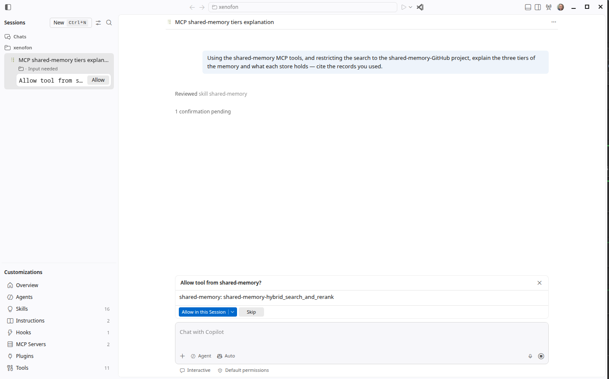
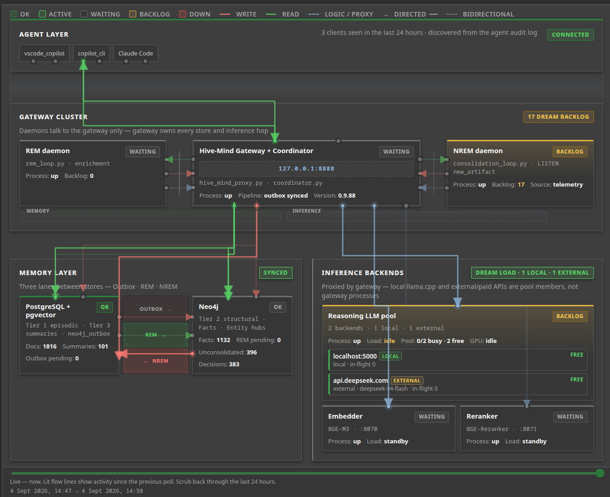
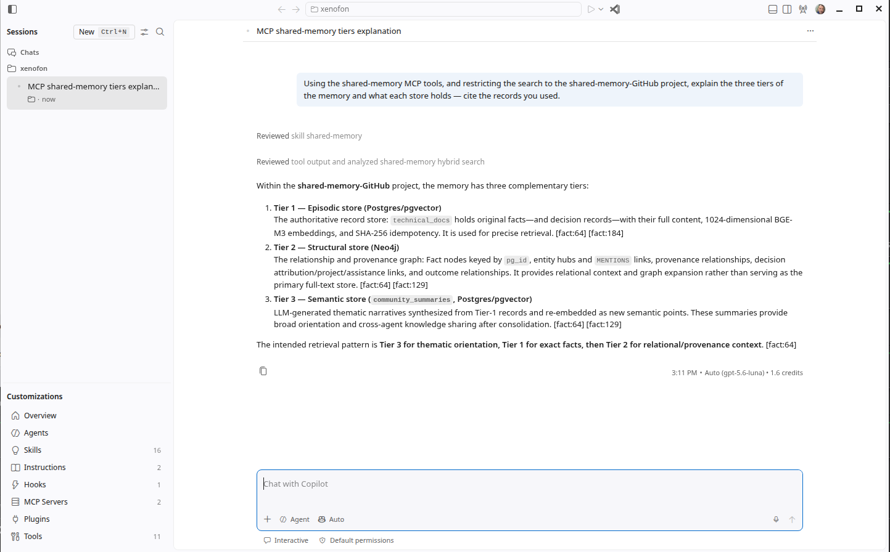

# VS Code and GitHub Copilot: mounting the memory as MCP tools

GitHub Copilot in VS Code can search this memory the same way LM Studio and opencode do — through
the one MCP connector in [`mcp/`](../../mcp/), talking to the same gateway every other agent uses.
This page is the walkthrough we followed to get there, including the two things that tripped us
up on the first run. Copilot's free tier includes Agent mode and MCP servers, so nothing here
needs a paid plan.

Two design choices up front, so the steps make sense:

- **Read-only, always.** A Copilot user has a CLI agent on the same machine for writes; Copilot
  itself only ever needs to *search*. A `read` token can reach retrieval and telemetry and gets an
  honest 403 on every write — which is the system working, not a fault to route around.
- **Nothing is ambient.** MCP tools are only called in Agent mode, by the agent's own judgement
  or when you ask. There are no inline hints and no sidebar that fills itself from the corpus.
  What you get is an assistant that can look things up before it answers — if you tell it to.

## Two surfaces, and which one you want

Copilot in VS Code reaches MCP servers through two different config files, and they are not
interchangeable:

| | VS Code Copilot Chat | Standalone Copilot CLI (also the Agents window) |
|---|---|---|
| Config file | `.vscode/mcp.json` in the folder you open | `~/.copilot/mcp-config.json` |
| Scope | that workspace only | every session, workspace or not |
| Top-level key | `"servers"` | `"mcpServers"` |
| Token handling | masked prompt on first start, kept in the OS keychain | none built in — a private `.env` beside a private copy of the connector |
| Instructions file | `.github/copilot-instructions.md` | `~/.copilot/copilot-instructions.md` (global) |

Set up the first one; it is simpler and the secret never touches a file. Add the second if you
also use Copilot with no folder open — that is the one case the first surface cannot see, and
the case where our first attempt went sideways (below).

## Surface 1 — VS Code Copilot Chat, `.vscode/mcp.json`

**1. Mint a read-only token.** VS Code will keep the secret itself, so this agent gets no install
path — which means the token has to be shown once, to you, in your own terminal. Run this
yourself, never through an agent (a revealed token in an agent transcript is stored forever):

```bash
bash shared-memory/scripts/bootstrap_tokens.sh --add vscode_copilot --role read --reveal vscode_copilot
systemctl --user restart hive-mind-gateway.service     # the gateway reads its token registry at startup
```

Copy the token from the terminal. It goes in exactly one place, in step 4.

**2. Write the config** in the folder you are going to open VS Code on. The `inputs` block is
VS Code's own mechanism for prompting a secret at server start and masking it; the file itself
never holds the value:

```json
{
  "inputs": [
    {
      "id": "shared_memory_token",
      "type": "promptString",
      "description": "shared-memory read-only token (vscode_copilot)",
      "password": true
    }
  ],
  "servers": {
    "shared-memory": {
      "command": "uv",
      "args": ["run", "--with", "fastmcp", "--with", "httpx",
               "python", "/path/to/shared-memory-GitHub/mcp/vector-skill.py"],
      "env": {
        "COORDINATOR_URL": "http://localhost:8888",
        "AGENT_TOKEN": "${input:shared_memory_token}"
      }
    }
  }
}
```

**3. Open VS Code on that folder.** This matters more than it sounds. `.vscode/mcp.json` is
workspace-scoped: with no folder open, the server is simply not there, and Copilot will not tell
you so unless you ask. Our first run did exactly this — asked to search the memory, it found the
CLI skill's script on disk and requested permission to shell out to it instead. Decline that
(the CLI skill is a different, write-capable identity), open the folder, start a new chat. Asked
directly why it could not see the server, Copilot's own answer was the diagnosis:
*"this session has no workspace open… the `.vscode/mcp.json` file is workspace-scoped."*

**4. Paste the token once.** The first time VS Code starts the server it shows a masked input for
`shared_memory_token`. Paste, Enter. That is the entire storage step — VS Code hands it to the
OS keychain and never writes it back into the JSON.

**5. Ask.** Switch Copilot Chat to Agent mode and ask something the memory would know. The
first tool call raises a permission prompt naming the tool (`Run Hybrid Search And Rerank`) and
what it does — *"reads shared memory narratives and facts — fetches public read-only data"* —
and "Allow in this session" is the right answer. From there Copilot chains calls on its own:
in our run, a hybrid search, three graph queries, a second search, and a synthesis that
distinguished the projects with recent decision volume from the ones merely registered.

## Surface 2 — the Copilot CLI, `~/.copilot/`

The standalone Copilot CLI is what VS Code's Agents window runs, and it keeps its own home
directory at `~/.copilot`. Its MCP config there is global — any session, folder or not — which is
exactly the gap surface 1 leaves. The catch: it has no masked-prompt mechanism, so the token has
to live in a file. The framework already has a shape for that (it is how opencode is wired): a
walled directory holding a private copy of the connector and a mode-600 `.env` beside it, and
the connector reads the `.env` next to its own file. The token never appears in any JSON.

**1. Make the directory and mint into it.** `--mcp` registers this as a connector install, so the
sync script knows what to deliver there; `--install-path` makes the mint *write* the token into
that file rather than print it:

```bash
mkdir -p ~/.copilot/shared-memory-mcp && chmod 700 ~/.copilot/shared-memory-mcp
bash shared-memory/scripts/bootstrap_tokens.sh --add copilot_cli --role read --mcp \
    --install-path ~/.copilot/shared-memory-mcp/.env
systemctl --user restart hive-mind-gateway.service
```

Nobody sees this token — not you, not an agent. That is the point of the write-through path.

**2. Deliver the connector.** The sync script reads the install registry, sees an `mcp`-kind
entry, and ships the connector package into the directory — `vector-skill.py`, the constitution
snippet, and the system prompt — checking that the copy byte-compiles, that modes are 700/600,
and that connector and gateway agree on the API version:

```bash
bash shared-memory/scripts/sync_skills.sh
```

**3. Register the server.** Note the different top-level key, and that there is no token here:

```json
{
  "mcpServers": {
    "shared-memory": {
      "command": "uv",
      "args": ["run", "--with", "fastmcp", "--with", "httpx",
               "python", "/home/you/.copilot/shared-memory-mcp/vector-skill.py"],
      "cwd": "/home/you/.copilot/shared-memory-mcp",
      "env": { "COORDINATOR_URL": "http://localhost:8888" }
    }
  }
}
```

Save it as `~/.copilot/mcp-config.json`. (The connector resolves its `.env` from its own file
location, so `cwd` is for clarity, not correctness.)

**4. Give it the conduct.** This is the step that fixes "it went and used something else". The
CLI reads `~/.copilot/copilot-instructions.md` in every session, and the file the sync just
delivered — `~/.copilot/shared-memory-mcp/CONSTITUTION_SNIPPET_MCP.md` — is written for exactly
this: it names the tools the server actually exposes and opens with *search first, always*.
Copy the marked block (from `<!-- shared-memory:mcp-constitution-snippet` to its closing marker)
into `~/.copilot/copilot-instructions.md` verbatim, markers included, so a later upgrade can find
and replace it rather than duplicate it.

**5. Restart and check.** Restart VS Code (MCP hosts read their environment once, at spawn). In
the Agents window's sidebar, *MCP Servers* and *Instructions* each go up by one.

**6. Ask — start small.** *"Is the gateway healthy?"* is a good first question: it exercises the
connection without needing the corpus, and the answer comes back as the gateway's own health
report — stores, encoders, LLM pool, daemons, warnings. Then ask something only the memory would
know. The first search raises the CLI's permission prompt with the tool's full id:



"Allow in this Session" once, and it stops asking. You may notice a *Reviewed skill shared-memory*
line before the tool call — Copilot glances at the CLI skill's description as background. Reading
it is harmless; a request to *run* it is what you decline.

## What it looks like when it works

The companion dashboard discovers clients from the gateway's audit log. After both surfaces were
up, it showed three — the two Copilot identities beside the CLI agent — with the read path from
`copilot_cli` lit during the test:



And this is Copilot answering from the memory rather than from its own reading of the code —
asked to explain the three tiers and cite its sources, with the search scoped to one project.
Every claim carries the record it came from:



The answer is a fair test of the whole chain: the tier names, the store each one lives in and the
retrieval order all match what the code does, and the citations are records the gateway returned,
not numbers the model produced.

## Things that will save you an hour

- **The two config files use different keys.** `.vscode/mcp.json` wants `"servers"`;
  `~/.copilot/mcp-config.json` wants `"mcpServers"`. VS Code's JSON validation flags the wrong
  one immediately; the CLI just silently sees no server.
- **No folder open means no `.vscode/mcp.json`.** If Copilot starts improvising — reading files,
  asking to run scripts — that is usually why. Ask it *"why can't you see the MCP server?"*; it
  will tell you.
- **The server log does not say "shared-memory".** The connector's own banner names its internal
  app (`Local_RAG_Orchestrator`); that is the line to look for in VS Code's Output panel, followed
  by *Discovered 11 tools*.
- **Restart both ends after a token change.** The gateway freezes its registry at startup; the
  MCP host freezes its environment at spawn.
- **A 403 on a write is correct.** These are `read` identities. If Copilot reports it could not
  save something, it is telling the truth, and the fix is to save it from a write-capable agent.
- **Do not register a database MCP server alongside this one.** A direct Postgres or Neo4j
  connection bypasses read authorization and the outbox; the connector already covers retrieval
  and graph expansion through the authorized path.
